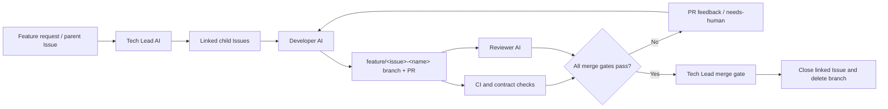

# OpenAgent

> An event-driven AI development team built around Codex and GitHub.

OpenAgent explores a practical workflow in which a **Tech Lead AI** and several
specialist **Developer AIs** collaborate through GitHub Issues, pull requests,
comments, and CI events.

## Why

Coding agents are already capable of understanding repositories, implementing
features, running tests, and reviewing changes. The missing piece is a safe,
auditable workflow that turns a feature request into small tasks, reviewable
pull requests, and a controlled merge decision.

OpenAgent focuses on that orchestration layer rather than trying to build a new
foundation model or code editor.

## Target workflow

All agent-to-agent handoffs are represented in GitHub through Issues, labels,
pull requests, review comments, and workflow events.

## Roles

| Role | Responsibilities |
| --- | --- |
| Tech Lead AI | Analyse requests and repository context, create and sequence Issues, review PRs, decide whether merge conditions are met, and report outcomes. |
| Developer AI | Implement one scoped Issue on an isolated branch, run the required checks, open a clear PR, and address review feedback. |
| Reviewer AI | Inspect the PR diff and test evidence for correctness, regressions, security concerns, and missing coverage. |
| GitHub Actions | Provide the event-driven execution environment, CI signals, and an auditable record of each transition. |

## Design principles

- **GitHub is the shared workspace.** Issues and PRs are the source of truth;
  agent state must not live only in a transient chat session.
- **Small, reviewable changes.** One Issue should normally produce one focused
  branch and pull request.
- **Least privilege.** Use separate bot identities for implementation and
  merge/review decisions, with only the permissions each workflow needs.
- **Tests decide, not prose.** A passing build, relevant tests, linting, and
  branch-protection rules are merge gates.
- **Bounded autonomy.** Automated repair attempts are limited. Sensitive or
  repeated failures are labelled `needs-human` instead of looping forever.

## Initial architecture

The first version will use:

- Codex for implementation, analysis, test execution, and code review.
- GitHub Actions to trigger repeatable workflows on Issues, PRs, and CI
  results.
- A GitHub App (preferred) or tightly scoped workflow token to create Issues,
  push branches, comment on PRs, and merge only approved changes.
- Repository guidance in `AGENTS.md`, plus issue and pull-request templates.

## Bootstrap prerequisites

The checked-in workflows deliberately fail closed: a failing CI check or a
missing provider credential blocks merge rather than bypassing review.

1. Add `NEWAPI_API_KEY` as a GitHub Actions secret before running the Tech
   Lead, Developer, or Reviewer workflows. The configured New API relay has
   been verified against Codex's Responses API and function-calling flow.
2. Never commit API keys, paste them into Issues or pull requests, or store
   them in repository variables. Rotate any key that was accidentally exposed.
3. Keep provider credentials in GitHub Actions secrets, scope them to the
   Codex step, and retain validation tests. Do not weaken the existing Codex
   review gate to accommodate a provider.

## Roadmap

- [x] Add repository guidance and contribution conventions.
- [x] Add Issue and pull-request templates plus a label-based state machine.
- [x] Implement a Tech Lead workflow that turns a feature Issue into linked,
      scoped tasks.
- [x] Implement a Developer workflow that creates a branch and PR.
- [x] Implement a read-only Reviewer workflow for PR feedback.
- [ ] Add CI-failure triage with a bounded automatic repair loop.
- [ ] Define branch protection and conservative auto-merge rules.

## Status

This repository is at the design/bootstrap stage. No autonomous merge behavior
is enabled yet.

## License

License selection is pending.
